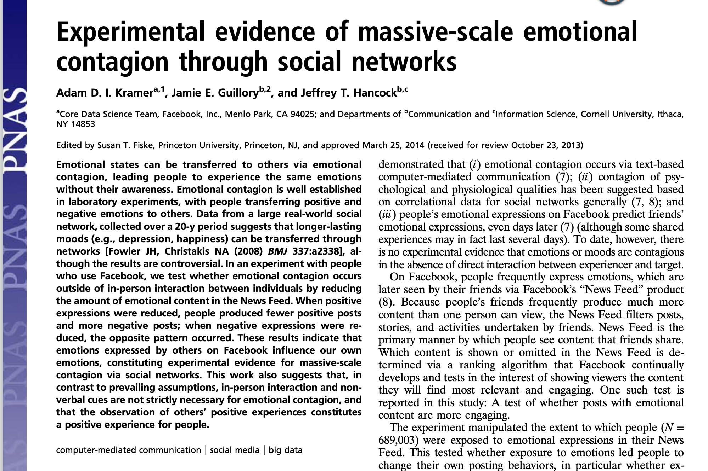
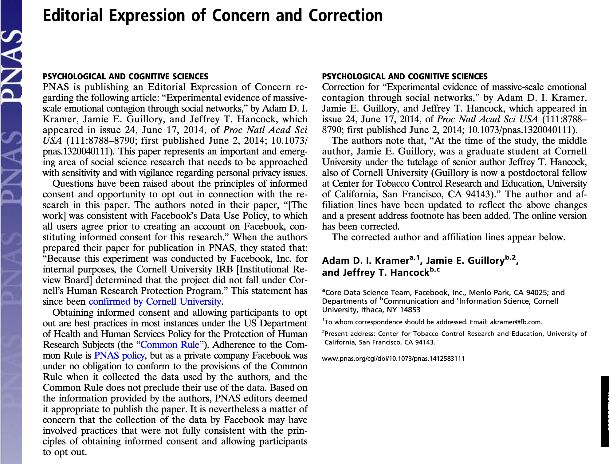

# Etyka badań naukowych

---

# Etyka w badaniach

* Przestrzeganie kodeksów etycznych
* Unikanie plagiatów i auto-plagiatów
* Problemy świadomej zgody
* Etyczne raportowanie wyników badań
* Przechowywanie i dzielenie się danymi „surowymi”
* Problem dublowania publikacji i dzielenia ich na części

---

# Problem plagiatu

---

# Plagiat wg kodeksu NCN

Plagiat polega na przywłaszczeniu sobie autorstwa całości lub części cudzego utworu w rozumieniu przepisów ustawy z dnia 4 lutego 1994r. o prawie autorskim i prawach pokrewnych. W szerszym rozumieniu plagiatem jest również przypisywanie sobie cudzych idei, wyników lub określeń bez właściwego odniesienia do nazwiska twórcy, a także nieautoryzowane wykorzystanie informacji uzyskanych w trakcie poufnego recenzowania wniosków i manuskryptów

---

# Więcej o plagiatach

<https://usosweb.uksw.edu.pl/instrukcje/Praktyczny_przewodnik_antyplagiatowy_NKohtamaki.pdf>
<https://pl.wikipedia.org/wiki/Plagiat>

---

# Kodeksy etyczne

- Kodeks PTP
- Kodeks APA
- Kodeks NCN

---

# Kodeks PTP

Jest nowy! 2018 rok. 

---

> 12.3. Praktyka oparta na wynikach badań naukowych
> 12.3.a. Ze względu na naukowy charakter podstaw praktyki zawodowej, psycholog dysponuje aktualną i adekwatnie szeroką wiedzą z dziedziny psychologii jako dyscypliny naukowej. Posiada aktualną i możliwie jak najszerszą wiedzę związaną z obraną przez siebie specjalnością, w szczególności wiedzę wykraczającą poza obszar akademickiego kształcenia podstawowego.
> 12.3.b. Psycholog wykorzystuje w praktyce zawodowej metody posiadające wystarczające podstawy naukowe i nie stosuje metod, których skuteczność została podważona przez badania naukowe. Psycholog potrafi uzasadnić swoje stanowisko w sprawach zawodowych, odnosząc się do wiedzy naukowej.

---

# Kodeks APA - Standardy

---

8.01 Institutional Approval 

> When institutional approval is required, psychologists provide accurate information about their research proposals and obtain approval prior to conducting the research. They conduct the research in accordance with the approved research protocol.

---

8.02 Informed Consent to Research 

> (a) When obtaining informed consent as required in Standard 3.10, Informed Consent, psychologists inform participants about 
> (1) the purpose of the research, expected duration, and procedures; 
> (2) their right to decline to participate and to withdraw from the research once participation has begun; 
> (3) the foreseeable consequences of declining or withdrawing; 

---

> (4) reasonably foreseeable factors that may be expected to influence their willingness to participate such as potential risks, discomfort, or adverse effects; 
> (5) any prospective research benefits; 
> (6) limits of confidentiality; 
> (7) incentives for participation; and 
> (8) whom to contact for questions about the research and research participants' rights. They provide opportunity for the prospective participants to ask questions and receive answers. (See also Standards 8.03, Informed Consent for Recording Voices and Images in Research; 8.05, Dispensing with Informed Consent for Research; and 8.07, Deception in Research.)

---

> (b) Psychologists conducting intervention research involving the use of experimental treatments clarify to participants at the outset of the research: 
> (1) the experimental nature of the treatment; 
> (2) the services that will or will not be available to the control group(s) if appropriate; 
> (3) the means by which assignment to treatment and control groups will be made; 
> (4) available treatment alternatives if an individual does not wish to participate in the research or wishes to withdraw once a study has begun; and 
> (5) compensation for or monetary costs of participating including, if appropriate, whether reimbursement from the participant or a third-party payor will be sought. (See also Standard 8.02a, Informed Consent to Research.)

---

8.03 Informed Consent for Recording Voices and Images in Research 

> Psychologists obtain informed consent from research participants prior to recording their voices or images for data collection unless (1) the research consists solely of naturalistic observations in public places, and it is not anticipated that the recording will be used in a manner that could cause personal identification or harm, or (2) the research design includes deception, and consent for the use of the recording is obtained during debriefing. (See also Standard 8.07, Deception in Research.)

---

8.04 Client/Patient, Student, and Subordinate Research Participants 

> (a) When psychologists conduct research with clients/patients, students, or subordinates as participants, psychologists take steps to protect the prospective participants from adverse consequences of declining or withdrawing from participation.
> (b) When research participation is a course requirement or an opportunity for extra credit, the prospective participant is given the choice of equitable alternative activities.

---

8.05 Dispensing with Informed Consent for Research 

> Psychologists may dispense with informed consent only 
> (1) where research would not reasonably be assumed to create distress or harm and involves 
> (a) the study of normal educational practices, curricula, or classroom management methods conducted in educational settings; 
> (b) only anonymous questionnaires, naturalistic observations, or archival research for which disclosure of responses would not place participants at risk of criminal or civil liability or damage their financial standing, employability, or reputation, and confidentiality is protected; or 
> (c) the study of factors related to job or organization effectiveness conducted in organizational settings for which there is no risk to participants' employability, and confidentiality is protected or 
> (2) where otherwise permitted by law or federal or institutional regulations.

---

8.06 Offering Inducements for Research Participation 

> (a) Psychologists make reasonable efforts to avoid offering excessive or inappropriate financial or other inducements for research participation when such inducements are likely to coerce participation.
> (b) When offering professional services as an inducement for research participation, psychologists clarify the nature of the services, as well as the risks, obligations, and limitations. (See also Standard 6.05, Barter with Clients/Patients.)

---

# Nieetyczne badania w psychologii - Hall of Fame

---

# Eksperyment Milgrama

---

# Stanfordzki eksperyment więzienny Zimbardo

---

# The Aversion Project - Aubrey Levin

* RPA, apartheid
* Uczestnicy - homoseksualni żołnierze (ok. 900 objętych programem)
* Przymusowe elektrowstrząsy i terapia awersyjna
* Po zakończeniu apartheidu sam dr Levin wyemigrował do Kanady, gdzie praktykował jako psychiatra
* Został nawet profesorem na University of Calgary aż do 2013 roku gdy... został skazany za molestowanie seksualne swoich 30 pacjentów (mężczyzn!)

---

# The Monster Study (1939)

* Werbalne znęcanie się nad dziećmi jąkającymi się
* Dzieci "zdrowe" po procedurze eksperymentalnej zaczęły się jąkać

---

# Dziś wciąż robi się nieetyczne badania

---

---

--- 