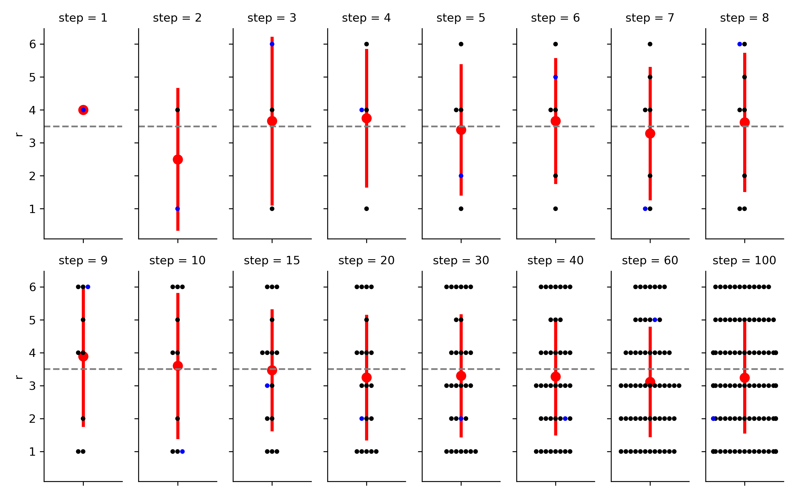
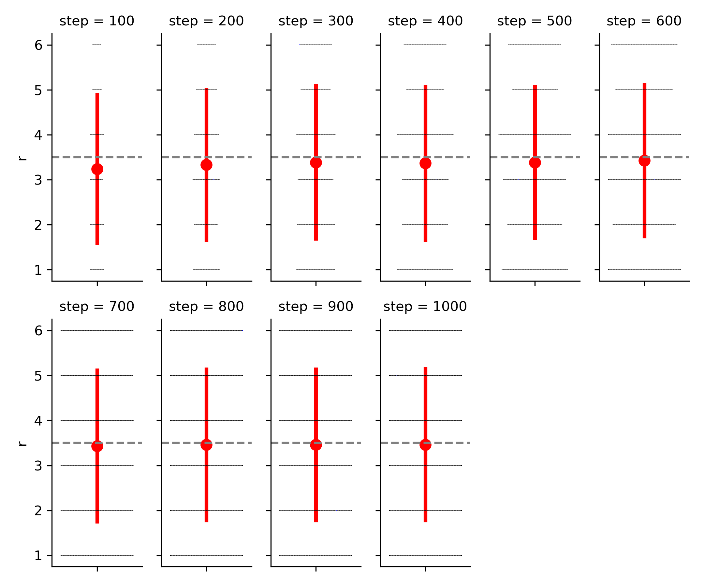
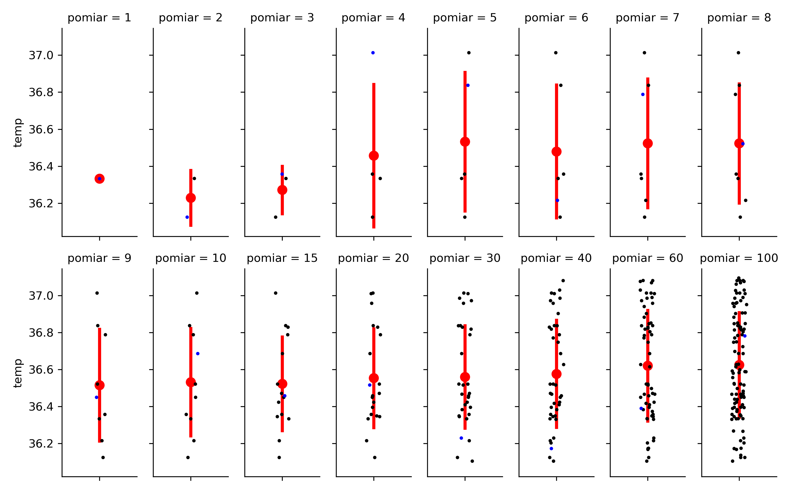

# Rzetelność pomiaru

---

# Rzetelność (reliability)

Czy test **dobrze** (rzetelnie) mierzy to co ma mierzyć?

---

# Rzetelność - proste przykłady

* Zważ się dwa razy na tej samej wadze. Czy ważysz tyle samo?
* Jaka jest temperatura za oknem? Jak zmienia się, w zależności od tego czy na termometr świeci słońce?
* Jaka jest temperatura twojego ciała? Jak zmienia się, w zależności od tego jak ją zmierzysz?

---

# Ogólny model rzetelności

* Wynik pomiaru zależy od prawdziwej wartości zmiennej
* Wynik pomiaru zależy też od błędu, wynikającego z niedoskonałości metody pomiaru bądź innych czynników
* Równanie klasycznej teorii testów:

$$ wynik testu = wynik prawdziwy + błąd $$

---

# Błąd pomiaru

* Błąd może być losowy
* Błąd może być systematyczny
* **Średnia błędu losowego dąży do 0**

---

# Rzucamy kostką

* Rzucamy 1 raz... Jaki jest średni wynik?
* Rzucamy 2 razy... Jaki jest średni wynik?
* Rzucamy 3 razy... Jaki jest średni wynik?
* Rzucamy 10 razy... Jaki jest średni wynik?
* Rzucamy 1 000 razy... Jaki jest średni wynik?

---

# Prawo dużych liczb

]

---

]

---

# Mierzymy gorączkę...

]

---

* **Średnia błędu losowego przy wielokrotnych pomiarach dąży do 0!**

---

# Metody badania rzetelności

* W praktyce często z błędem da się żyć, jeżeli jesteśmy w stanie go **oszacować**
* Test-retest: czy dwa pomiary tym samym testem w różnym czasie dadzą ten sam wynik?
* Zgodność wewnętrzna: czy poszczególne pozycje w kwestionariuszu mierzą ten sam konstrukt?

---

# Uwagi końcowe

* Trafność i rzetelność to nie tylko problemy testów psychologicznych
* Test wysoce rzetelny może być kompletnie nietrafny. 
* Test trafny może być kompletnie nierzetelny.
