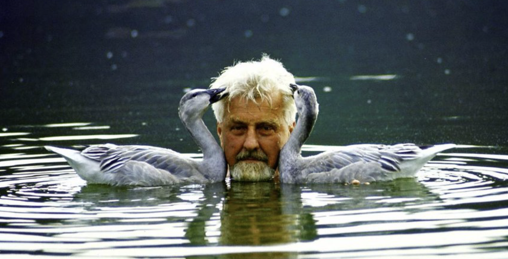
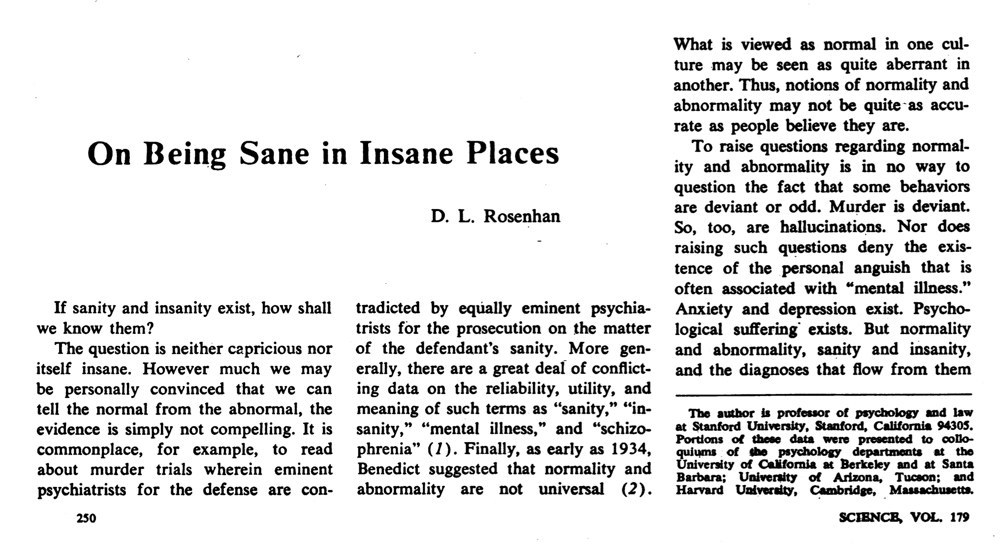

# Obserwacja

---

# Obserwacje naukowe i nienaukowe

Aby obserwacja była naukowa, powinna być:

* Systematyczna
* Możliwie obiektywna 
* Rzetelna

---

# Rodzaje obserwacji

* Obserwacje bez interwencji (obserwacje naturalne)
* Obserwacje z interwencją

---

# Obserwacje naturalne

* W warunkach naturalnych (cokolwiek to znaczy!)
* Ważna jest maksymalizacja trafności i zdolności predykcyjnej obserwacji (czy związek, który obserwuję pozwala na prognozowanie przyszłości?)
* Często trudno jest obserwować ludzi w naturalnych sytuacjach bez ingerencji w ich zachowanie
* ...chociaż technologia pozwala robić to coraz lepiej!

---

# N-ty rodzaj trafności - trafność ekologiczna

* _Ecological validity_
* Inaczej: _trafność zewnętrzna_
* Czy wyniki badania odzwierciedlają zależności/mechanizmy obecne w prawdziwym świecie?
* Trafność ekologiczna jest częstym problemem w badaniach eksperymentalnych
* Obserwacje naturalne mają (najczęściej) wysoką trafność ekologiczną

---

# Przykłady

* Dzieci na placu zabaw (Hartup, 1974)
* Częstość zachowań agresywnych a płeć
* Podział na agresję wrogą (_zrobię ci kuku bo cię nie lubię!_) i instrumentalną (_zrobię ci kuku, bo mi się to opłaca!_)
* Chłopcy częściej zachowywali się agresywnie niż dziewczynki
* Brak różnic w agresji wrogiej i instrumentalnej pomiędzy płciami

---

# Etologia

* W biologii to samo nazywa się **etologią**
* Ojcowie założyciele: Konrad Lorenz, Karl von Frisch, Niko Tinbergen (Nobel 1973)
* _Interviewing the animal in its own language_ 
* Fixed action patterns (_zachowania instynktowne_) - wrodzone, stereotypowe zachowania ukierunkowane na konkretny cel

---

<https://www.youtube.com/watch?v=7PcteKRA3zs>

---

# Imprinting

---

# Imprinting

---

# Imprinting

---

# Tańce pszczół

* _Waggle dance_
* Pokazuje kierunek, w którym trzeba polecieć żeby znaleźć nektar
* <https://www.youtube.com/watch?v=12Q8FfyLLso>

---

# Literatura dodatkowa

Robert Sapolsky o etologii:

<https://www.youtube.com/watch?v=ISVaoLlW104>

---

# Obserwacje z interwencją

---

# Obserwacja uczestnicząca

* Obserwator jest uczestnikiem zdarzeń
* Może być zamaskowany albo niezamaskowany
* Jedna z podstawowych metod w **etnografii** - poznawanie kultur poprzez mieszkanie z nimi
* Może być zamaskowana lub nie (badani zdają sobie sprawę z tego, że obserwator jest naukowcem bądź nie)

---

# Przykład - Eksperyment Rosenhana

---

---

# Inne przykłady 

* Jane Goodall, która żyła wśród szympansów
* John Howard Griffin, który pomalował się na czarno, żeby doświadczyć uprzedzeń i prześladowań
* Kirkham, kryminolog który stał się policjantem:
> Z upływem tygodni i miesięcy mojej kariery policjanta powoli, choć nieubłaganie stawałem się podobny w postawie i zachowaniu do innych policjantów, z którymi pracowałem. Zdaniem mojej rodziny, znajomych i przyjaciół w moim postępowaniu zaczęły się przejawiać nowe elementy, które były zupełnie obce mojej poprzedniej osobowości - skłonność do karania, cynizm, nieufność wobec innych, ciągłe poirytowanie i wrogość, rasizm (...). Wcześniej przeciwnik kary śmierci, stałem się jej zagorzałym zwolennikiem w wypadku sprawców morderstwa, uprowadzenia i zabójstwa policjanta - pomimo że jako kryminolog zdawałem sobie sprawę z jej nieefektywności jako straszaka przed popełnieniem zbrodni.

--- 

# Obserwacja ustrukturyzowana

* Czasem obserwatorzy **wywołują** interesujące zdarzenie
* Rejestracja zachowania wywołanego jakimś zdarzeniem
* Np. zadania poznawcze Piageta
* Np. procedury badania wzorców przywiązania
* Np. imprintowanie gąsek, którego dokonywał Konrad Lorenz

---

# Metody obserwacyjne - zalety

* Trafność ekologiczna
* Często jedyna możliwość etycznego prowadzenia badań
* Dobre źródło danych do spekulacji i rozwoju teorii naukowych

---

# Metody obserwacyjne - wady

* Brak możliwości wyciągania wniosków przyczynowych
* W przypadku obserwacji uczestniczącej, często źródłem obserwacji jest sam badacz: możliwy bias 
* Efekt obserwatora - sam fakt obserwacji zmienia zachowanie
* Niedostateczna kontrola zmiennych zakłócających/pośredniczących
