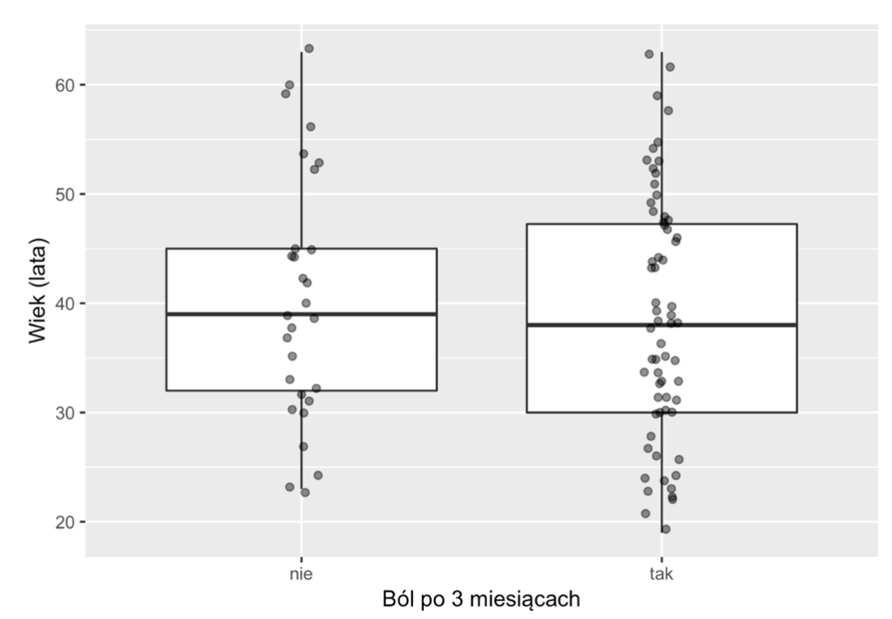

# Porównania międzygrupowe

---

# Porównania międzygrupowe

* Czy grupy wyłonione pod względem jakiejś zmiennej niezależnej różnią się poziomami zmiennej zależnej?
* Często w schemacie grupa kontrolna vs. grupa badana

---

# Przykładowe pytania badawcze

* Czy kobiety i mężczyźni różnią się pod kątem sumienności?
* Czy uczniowie liceów i techników różnią się pod kątem umiejętności matematycznych?
* Czy chorzy na depresję mają bardziej zewnętrzne poczucie kontroli?

---

# Wyzwania w porównaniach międzygrupowych

* Wnioski uzależnione od tego, jakie grupy porównamy
* Problem **grupy kontrolnej**
* Rekrutacja do grup (kryteria włączenia/wyłączenia)

---

# Grupy kontrolne

* Chcemy, aby grupa kontrolna nie różniła się niczym od grupy badanej (nie licząc zmiennej niezależnej)
* _Group-matching_ - dobór celowany do grupy kontrolnej tak, aby była jak najbardziej podobna do grupy badanej
* Problem: pod względem jakich zmiennych porównywać grupy?

---

# Kryteria włączenia i wyłączenia

* W badaniach z pogranicza medycyny często dobór do grup formalizuje się poprzez kryteria włączenia/wyłączenia (_inclusion/exclusion_)
* Kryteria włączenia - osoba **musi je spełnić, aby być zakwalifikowana**
* Kryteria wyłączenia - osoba **nie może ich spełnić, aby być zakwalifikowana**

---

# Przykładowe kryteria włączenia

1. Rozpoznanie – niespecyficzny ból dolnego odcinka kręgosłupa – wg. ICD-10:
   a. M54.3 – rwa kulszowa
   b. M54.4 – rwa kulszowa z bólem lędźwiowo-krzyżowym
   c. M54.5 – ból okolicy lędźwiowo-krzyżowej
2. Przed pojawieniem się obecnych dolegliwości nie odczuwał(a) bólu pleców przez okres co
najmniej 3 miesięcy
3. Ma pomiędzy 18 a 65 lat
. Czyta i pisze w języku polskim

---

# Przykładowe kryteria wyłączenia

1. Znana jest (lub podejrzewana) przyczyna bólu (np. uraz, guz, osteoporoza, infekcja, ból
korzeniowy, reumatoidalne zapalenie stawów)
2. Ciąża
3. Inną, poważna choroba (np. nowotwór, niewydolność krążeniowo-oddechowa)

---

# Analiza wyników w porównaniach międzygrupowych

* Najczęściej porównujemy miary tendencji centralnej (średnie/mediany)
* Testy statystyczne - t Test, jednoczynnikowa ANOVA, Mann-Whitney, metody bayesowskie i wiele innych...
* Często wizualizacja przy pomocy boxplotów
* _The new statistics_ - jeśli możesz, pokaż wszystkie punkty danych (<https://thenewstatistics.com/itns/>)

---

# Boxplot, Tukey Style / new statistics

