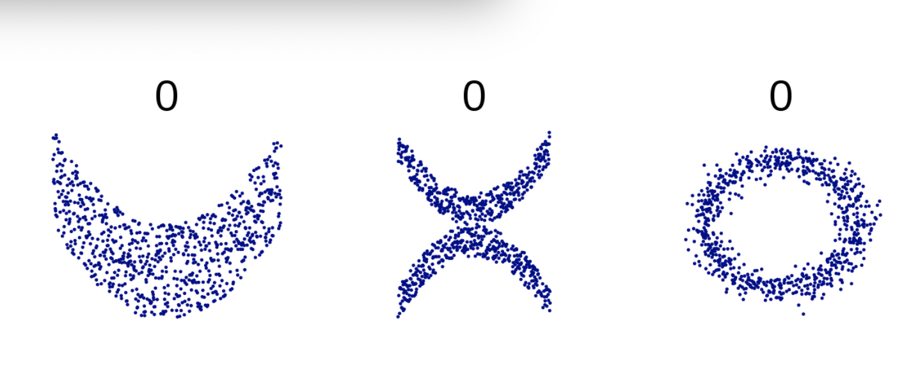

# Schematy korelacyjne

---

# Korelacja

* Miara siły związku pomiędzy zmiennymi
* Najczęściej - współczynnik korelacji (r Pearsona, rho Spearmana, tau Kendalla)
* Silna, słaba, umiarkowana
* Dodatnia, ujemna

---

# Najprostszy schemat - dwie zmienne

* Zmienna niezależna i zmienna zależna
* Obie na skalach przedziałowych albo ilorazowych (w uzasadnionych wypadkach skala przedziałowa, wtedy statystyki nieparametryczne)
* Obserwacje powiązane - mierzymy obie zmienne u **tej samej osoby** (najczęściej w tym samym czasie)

---

# Dwie zmienne - przykładowe pytania

* Czy inteligencja wiąże się z zarobkami?
* Czy wyniki z matematyki wiążą się z wynikami z fizyki?
* Czy ekstrawersja wiąże się z otwartością na doświadczenie?
* Czy spożycie sera _per capita_ w danym roku wiąże się z liczbą zgonów spowodowanych owinięciem w prześcieradło? (r = 0.95)

---

# Wykresy rozrzutu

---

# Wykresy rozrzutu

---

# Wykresy rozrzutu

---

# Dziwactwa korelacyjne

---

# Dziwactwa korelacyjne

---

---

# Kwartet Anscombe'a

Cecha |	Wartość
---|---
Średnia arytmetyczna zmiennej x |	9
Wariancja zmiennej x | 11
Średnia arytmetyczna zmiennej y	 | 7.50 (identyczna do dwóch cyfr po przecinku)
Wariancja zmiennej y | 4.122 lub 4.127 (identyczna do trzech cyfr po przecinku)
Współczynnik korelacji pomiędzy zmiennymi | 0.816 (identyczny do trzech cyfr po przecinku)

---

> Dlatego ważna jest reprezentacja graficzna danych! (Francis Anscombe)

---

# Korelacja a przyczynowość

* **Korelacja nie wskazuje przyczynowości! (correlation doesn't imply causation)**
* Czyli: z tego, że A koreluje z B nie możemy stwierdzić, że A spowodowało B.
* Ale w niektórych przypadkach mogło tak być:)

---

# Przyczynowość a korelacje

* A powoduje B (przyczynowość)
* B powoduje A (odwrotna przyczynowość)
* A powoduje B, które powoduje A (zależność kołowa, sprzężenie)
* A i B są spowodowane przez inną zmienną, C
* A powoduje C, C powoduje B (mediacja)
* Nie ma związku pomiędzy A i B (Nicolas Cage i utonięcia w basenie)

---

# Wyzwania techniczne

* Odpowiednia wielkość próby
* Odpowiednia wariancja każdej ze zmiennych