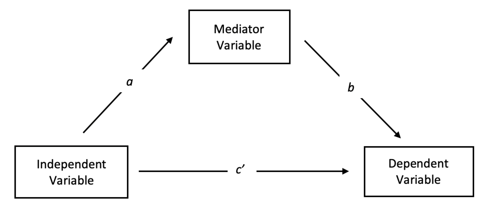
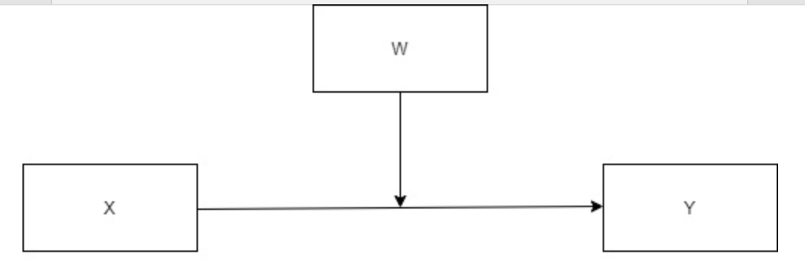

# Modele wielozmiennowe

---

# Współzmienność a modelowanie

* Korelacja odpowiada na pytanie o **współzmienność** miedzy zmiennymi
* Możemy coś sądzić na temat przyczynowości, mechanizmów itd., jednak w praktyce często niewiele możemy się na ten temat dowiedzieć
* Często lepiej jest pytać o to, czy X pozwala **przewidywać** Y
* To jest problem **modelowania**: czy możemy na podstawie X **przewidywać** wartości Y?
* Modelowanie to tworzenie matematycznych modeli, które opisują Y _jako funkcję_ X a następnie określanie ich dopasowania do danych
* X jest **predyktorem** w modelu

---

# Współzmienność a modelowanie

* Współzmienność opisujemy w kategoriach korelacji 
* Model w kategoriach **ilości (procenta) wyjaśnianej wariancji**, dopasowania modelu do danych itp.
* Dobry model to taki, który wyjaśnia dużo wariancji zmiennej zależnej
* Inaczej: dobry model to taki, który pozwala dobrze (z wysokim prawdopodobieństwem) przewidywać wartości zmiennej zależnej na podstawie predyktorów (zmiennych niezależnych)

---

# Proste schematy korelacyjne

* X -> Y
* Prosta korelacja oddaje siłę związku
* Prawie **nigdy** nie wiemy, czy **tylko** X powoduje Y

---

# Schematy wielozmiennowe

* X1 -> Y
* X2 -> Y
* X3 -> Y
* ...
* Xn -> Y

---

# Notacja R-owa (R formula notation)

`Y ~ X1 + X2 + X3 + ... + Xn`

---

# Schematy wielozmiennowe

* **Wiele** zmiennych niezależnych **łącznie** wyjaśnia zmienną zależną
* Dlaczego tak jest lepiej?
* Najczęściej w psychologii badamy **skomplikowane** zjawiska, które mają więcej niż jedną przyczynę
* Wtedy jedynym sposobem na ich opis jest modelowanie za pomocą wielu zmiennych

---

# Ilustracja modelu z dwoma zmiennymi

<https://miabellaai.net/regression.html>

---

# Dlaczego warto badać wiele predyktorów naraz?

* Bo możemy określić, ile **łącznie** wyjaśniają wariancji
* Wariancja wyjaśniana nie zawsze się dodaje, ponieważ predyktory mogą być ze sobą skorelowane (i przeważnie są)
* I bo możemy określić wpływ czynnika A, jednocześnie **kontrolując** czynnik B, C i D

---

# Przykład

* Pytanie badawcze: skąd się bierze depresja?
* Pytanie jest niezbyt mądre, ale dobre do celów ilustracyjnych:)

---

# Model prosty

* `depresja ~ lęk`
* Ile wyjaśnia wariancji?
* Ile spośród tej wariancji tak na prawdę wyjaśnia lęk, a ile inne czynniki, które jednocześnie powodują lęk i depresję?

---

# Model wielozmiennnowy

* `depresja ~ lęk + czynniki osobowościowe + wsparcie społeczne + wiek + płeć + ogólny stan zdrowia`
* Więcej źródeł wariancji = lepsza **kontrola**
* Skąd wiemy, ile (i jakich) predyktorów dodać?
* To bardzo trudne!

---

# Porównywanie modeli

* Możemy porównywać konkurencyjne modele
* M1: `depresja ~ lęk + osobowość + wsparcie + wiek + płeć`
* M2: `depresja ~ lęk + osobowość + wsparcie + wiek + płeć + status społeczno-ekonomiczny`
* Czy M2 wyjaśnia więcej wariancji niż M1?

---

# Mediacja

---

# Mediacja

* Obserwujemy zależność między IV a DV (`c'`)
* **Teoretyzujemy**, że jest ona spowodowana **mediatorem**
* Sprawdzamy, czy jest zależność między IV a mediatorem (`a`)
* Sprawdzamy, czy jest zależność między mediatorem a DV (`b`)

---

# Przykład

* Dobre oceny powodują szczęście!
* `szęście ~ dobre_oceny`
* Ale! Może dobre oceny **zwiększają samoocenę**, która zwiększa szczęście?
* `szczęście ~ samoocena` oraz `samoocena ~ oceny`
* Weryfikujemy budując i porównując te trzy modele
* Szersze omówienie: <https://data.library.virginia.edu/introduction-to-mediation-analysis/>

---

# Moderacja

---

# Moderacja

* Obecność zmiennej `W` **zmienia siłę zależności** pomiędzy `X` a `Y`
* Zakładamy jednak przyczynowość pomiędzy `X` a `Y`, która jest _moderowana_ przez W
* Statystyczną miarą moderacji jest efekt interakcji

---

# Przykłady

* `zarobki ~ staż_pracy`
* Związek może być moderowany przez płeć!
* `zarobki ~ staż_pracy + płeć + staż_pracy:płeć`

