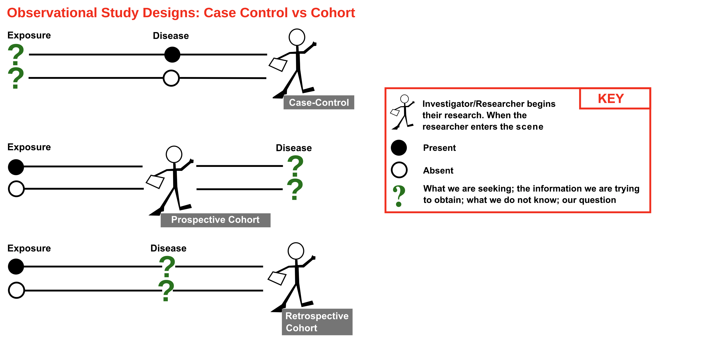
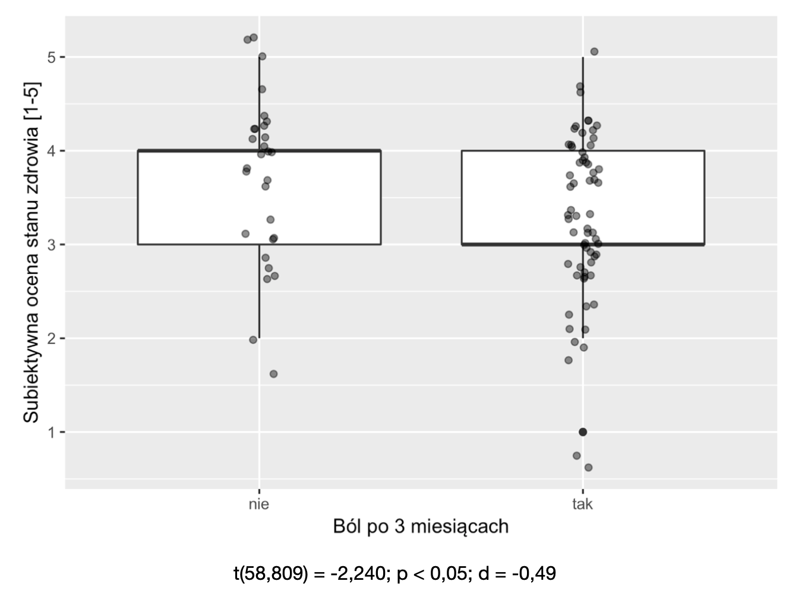
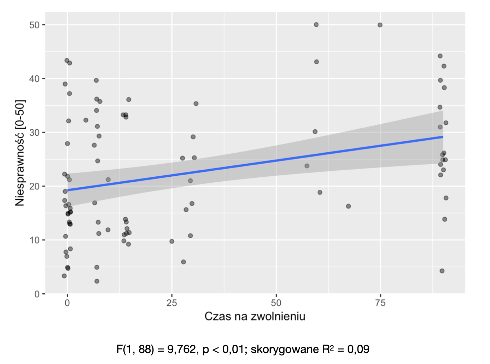
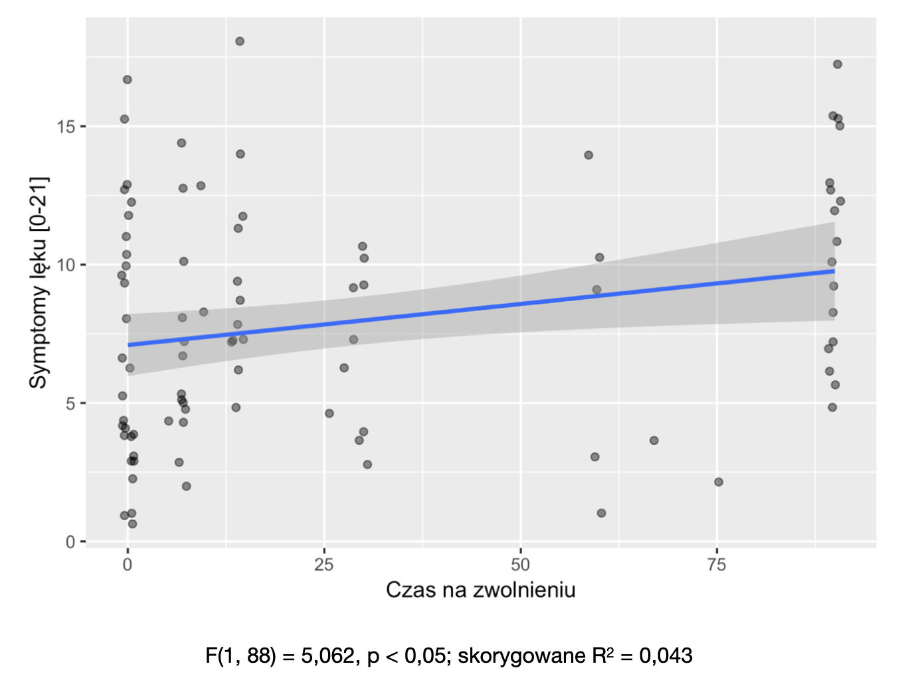
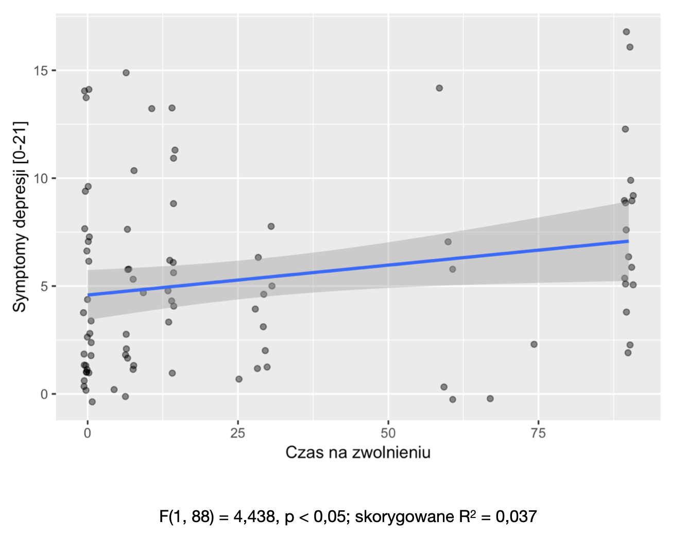
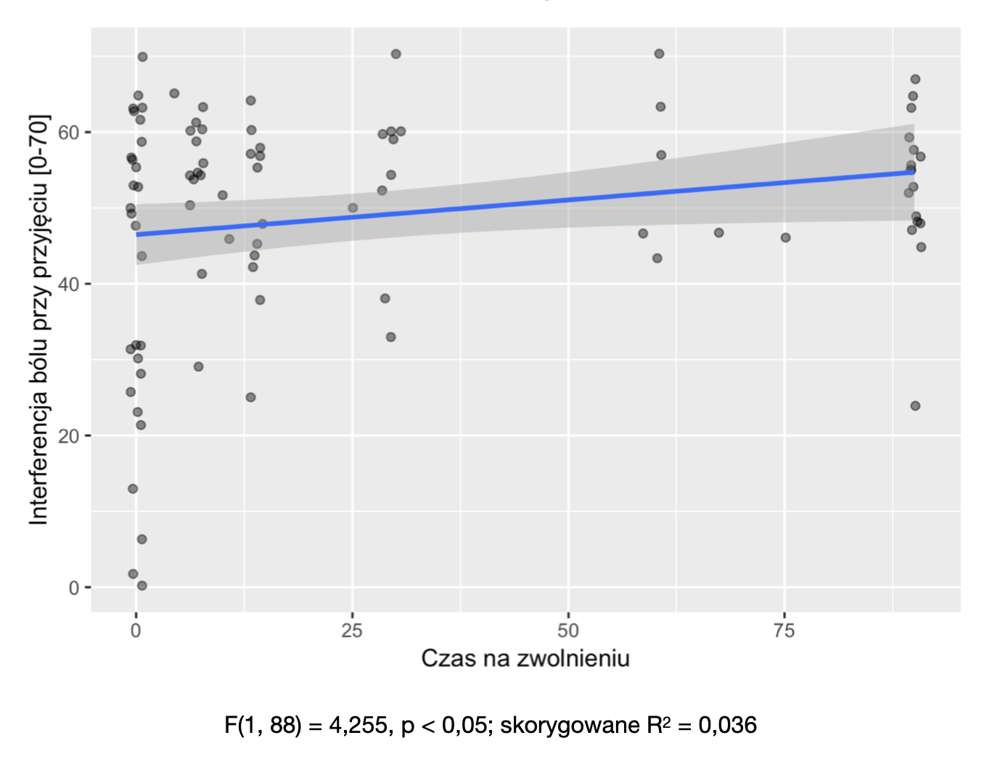

# Badania podłużne

---

# Badania podłużne

* Inaczej: badania longitudinalne, panelowe
* Przeciwieństwo badań _poprzecznych_ / _przekrojowych_ (pomiar w jednym punkcie czasu)
* Badania, w których badamy tych samych ludzi **w różnych punktach w czasie**
* Badania podłużne dostarczają **obserwacji zależnych** (które trzeba odpowiednio potraktować statystycznie)

---

# Badania podłużne

* Dostarczają danych o różnicach w poziomie zmiennych pomiędzy punktami w czasie
* Nie zawsze dobrze rozumiemy, skąd te różnice się wzięły
* Mogą być dwa punkty pomiaru, ale może też być więcej

---

# Przykłady

* Narodowy Spis Powszechny (porównania z poprzednim spisem)
* Diagnoza Społeczna (<http://www.diagnoza.com>)
* Badania w psychologii rozwojowej (obserwacja zmian rozwojowych, zmienną niezależną _rozwój_)
* Przykład: rozwój kompetencji językowych

---

# Warianty badań podłużnych (kohortowych)

* Kohorta - grupa ludzi, których łączy jakaś charakterystyka (np. ekspozycja na jakiś czynnik)
* Prospektywne badanie kohortowe (_prospective cohort study_)
* Retrospektywne badanie kohortowe (_retrospective cohort study_)

---

---

# Problemy i ograniczenia

* Czy upływ czasu **wpłynął** na zmienną zależną? (Przeblem przyczynowości)
* W gruncie rzeczy badanie longitudinalne dalej jest korelacyjne (tylko eksperymenty mówią coś o przyczynowości)
* Czy na pewno bierzemy pod uwagę wszystkie ważne czynniki?
* Problem utraty osób badanych w kolejnych punktach pomiaru (_lost to follow-up_)

---

# Przykład badania prospektywnego

---

# Cel

* Ustalenie psychospołecznych predyktorów odczuwania bólu w trzy miesiące po wystąpieniu epizodu ostrego bólu dolnego odcinka kręgosłupa 
* Próba przewidywania długości pobytu na zwolnieniu lekarskim na podstawie wybranych zmiennych socjodemograficznych i psychologicznych 

---

# Kryteria włączenia

* Pacjent KOR UCK w Gdańsku
* Rozpoznanie – niespecyficzny ból dolnego odcinka kręgosłupa 
* Przed pojawieniem się obecnych dolegliwości nie odczuwał(a) bólu pleców przez okres co najmniej 3 miesięcy 
* Ma pomiędzy 18 a 65 lat 
* Czyta i pisze w języku polskim 

---

# Kryteria wyłączenia

* Znana jest (lub podejrzewana) przyczyna bólu (np. uraz, guz, osteoporoza, infekcja, reumatoidalne zapalenie stawów) 
* Ciąża 
* Inna, poważna choroba (np. nowotwór, niewydolność krążeniowo-oddechowa) 

---

# Procedura badania

* Badanie po przyjęciu na KOR
* Telefoniczne badanie powtórne po 3 miesiącach

---
# Metody - pierwsza faza

* Krótki Inwentarz Bólu - Wersja Skrócona (BPI-SF) do pomiaru charakterystyki bólu 
* Kwestionariusz Oswestry (ODI) do pomiaru niesprawności spowodowanej bólem pleców 
* Szpitalna Skala Lęku i Depresji (HADS) do pomiaru lęku i symptomów depresyjnych 
* Wielowymiarowa Skala Umiejscowienia Kontroli Zdrowia (MHLC) do pomiaru poczucia umiejscowienia kontroli zdrowia 
* Kwestionariusz Strategii Radzenia Sobie z Bólem (CSQ) do pomiaru strategii radzenia sobie z bólem 
* Subiektywna samoocena stanu zdrowia (skala 5-stopniowa)
* Ankieta zbierająca dane socjo-demograficzne 

---

# Metody - badanie powtórne

* Ustrukturyzowany wywiad:
* obecność bólu
* długość zwolnienia lekarskiego z powodu bólu

---
# Osoby badane

* Zrekrutowano N = 110 (49 kobiet, 60 mężczyzn)
* W badaniu powtórnym N = 97 (88,1%)
* Wiek M = 39,34 (SD = 11,07) lat
* W większości mieli wykształcenie średnie (42,34%) lub wyższe (32,43%) 
* Większość mieszkała w mieście (81,98%), miała stałą pracę (78,38%) o charakterze nie fizycznym (43,24%)
* Średnie BMI = 27,06 (SD = 4,57)

---

# Analiza statystyczna

* Różnice między średnimi: test t Welcha, wielkość efektu (d Cohena)
* Miary korelacyjne: r Pearsona, analiza prostej regresji liniowej, skorygowane R2
* Analizy wielozmiennowe: wielokrotna regresja liniowa, analiza regresji logistycznej

---

# Wyniki

---

# Ból i czas na zwolnieniu
* 68 osób (70,10%) odczuwało dolegliwości bólowe po 3 miesiącach
* 29 osób (29,90%) nie odczuwało tych dolegliwości 
* Średnia długość zwolnienia lekarskiego wyniosła M = 28,26 (SD = 34,40)

---

# Subiektywna ocena stanu zdrowia

---

# Niesprawność

---

# Lęk

---

# Depression

---

# Pain interference

---

# Wnioski

* Z uwagi na prostotę, pomiar subiektywnej samooceny stanu zdrowia może w przyszłości być wykorzystywany w praktyce klinicznej do oceny ryzyka powstania przewlekłego bólu pleców. Konieczne są dalsze badania aby potwierdzić praktyczną użyteczność tej metody. 

---

# Ograniczenia
* Badanie powtórne tylko po 3 miesiącach
* Efekty sufitowe w pomiarze czasu spędzonego na zwolnieniu
* Brak pomiaru niesprawności po 3 miesiącach
* Być może pominięto istotne predyktory na etapie planowania