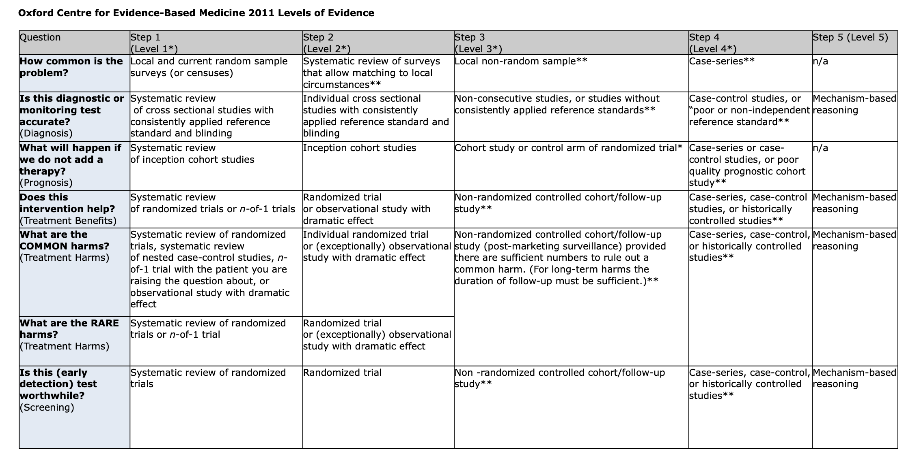

# Przeglądy i poziomy dowodów

---

# Przegląd badań

* "Badanie", którego przedmiotem są inne badania
* Celem pokazanie stanu wiedzy/literatury
* Może być narracyjny, niesystematyczny albo systematyczny
* Systematycznym przeglądom czasem towarzyszą metaanalizy

---

# Systematyczny przegląd badań zawiera:

* Jasne kryteria włączenia badań do przeglądu
* Jasne kryteria kwerendy baz danych artykułów naukowych
* Jasne kryteria oceny metodologicznej badań włączonych do przeglądu
* Użyteczny sposób kwantyfikacji wyników badań (prowadzący do wyciągnięcia sensownego wniosku)

---

# Metaanaliza

* Analiza wyników wielu badań
* Zawsze najpierw musimy zrobić systematyczny przegląd (żeby wiedzieć, które wyniki zawrzeć w metaanalizie)
* Pozwala ocenić siły efektów danych czynników biorąc pod uwagę wiele badań
* Łączy dane od bardzo wielu osób
* Czasem bardzo trudna/niemożliwa do zrobienia (bo dane za słabe, za mało literatury albo zbyt heterogeniczna literatura)

---

# Levels of evidence (poziomy "dowodów" naukowych)

---

# Evidence != dowód

* Słowo "evidence" tłumaczy się na polski jako "dowody" (naukowe), tak jak dowody w postępowaniu sądowym
* Jednak **nie można** tego rozumieć jako **dowodów** w sensie logicznym
* Dowód (wg. SJP PWN)
  1. «okoliczność lub rzecz dowodząca czegoś, świadcząca o czymś»
  2. «dokument urzędowy stwierdzający coś»
  3. log. «skończony ciąg zdań uzasadniający prawdziwość danego twierdzenia»
* Chodzi raczej o pierwsze znaczenie (wskazówki, poszlaki, itd)

---

# Levels of evidence (LoE)

* Wiele różnych klasyfikacji, których celem jest wskazanie źródeł najbardziej rzetelnej i opartej na _evidence_ wiedzy naukowej
* My opowiemy o klasyfikacji Levels of Evidence, Center for Evidence-Based Medicine, Oxford University (<https://www.cebm.ox.ac.uk/>)
* Te klasyfikacje są szczególnie ważne w naukach o zdrowiu/medycznych, żeby podejmować decyzje o najlepszej możliwej terapii

---

---

# Ograniczenia LoE

* Nie dają definitywnych odpowiedzi (nawet systematyczny przegląd nie mówi _prawdy o świecie_)
* Nie mówią o tym, która terapia jest _lepsza_ (bo to może zależeć od konkretnych wyników albo ich klinicznej istotności). 
* Nie mówią, czy terapia A jest lepsza od B (bo obie mogą mieć np. różne, nieporównywalne działania nieporządane)
* Nie mówią, czy zadajesz dobre pytanie (np. szukasz wyników leczenia depresji podczas gdy masz pacjenta z problemem neurologicznym)